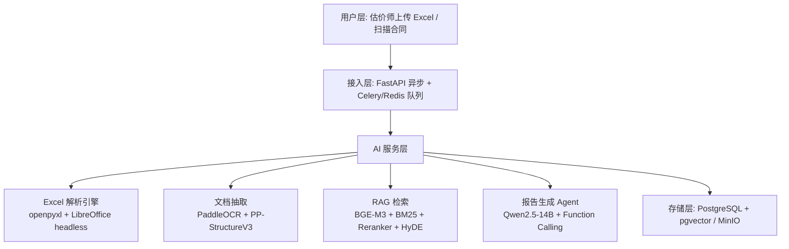

# 企业级 AI 估价助手（脱敏版）

> 为某国际地产咨询机构估价部设计的本地化 AI 系统：把估价师从 Excel 底稿、扫描合同、历史报告的重复劳动中释放出来——**单项目人工耗时从数天压缩到数小时**（设计目标）。

---

## 业务痛点

| 环节 | 现状 | 代价 |
|---|---|---|
| Excel 底稿提数 | 公式嵌套深、外部链接失效多，手动处理 | 单项目数天 |
| 扫描合同录入 | 租金/面积/租期人工肉眼识别 | 单份 10-30 分钟且易错 |
| 可比案例查找 | 凭经验翻历史报告，无结构化检索 | 漏查、错配常见 |
| 报告撰写 | 数据从 Excel 复制到 Word | 数值一致性靠人工三审 |

## 核心设计哲学

> **「计算确定性留给代码，语言灵活性留给 LLM」**

所有数字（租金、面积、DCF 结果、资本化率）从数据库直接注入 prompt，LLM 只负责组织语言，从不负责计算或回忆数值——从机制上消灭「AI 瞎编数字」这条估价业务红线。

配套**三层幻觉防控**：
1. **数据注入** — 数值全部来自 PostgreSQL，不凭印象
2. **强制引用** — 输出必须附 chunk id，无引用句子直接拒收
3. **数值强校验** — Critic Agent 把 AI 输出的每个数字与数据库比对，不一致打回重生成

## 系统架构（四层）

**部署**：全栈本地化（Qwen2.5-14B AWQ 4bit + vLLM，单张 RTX 4090 支撑 10-20 并发）——合同含商业机密，数据不出内网是企业级 AI 的硬约束。

## 三个工程难点与突破

### 1️⃣ Excel 公式重算与脏数据治理
xlsm 底稿的外部链接失效时，`openpyxl data_only=True` 读到的是 Excel 缓存的「假值」。
- LibreOffice headless 作独立计算引擎，强制重算全部公式
- 单底稿曾排查出 **145 个外部链接**：失效链接读 XML 缓存并打可信度分，低可信字段进人工复核队列——**宁可慢，不可错**

### 2️⃣ 垂直领域 RAG 检索准确率
估价专有名词密集（「转售资本化率」「收益还原法」），单向量检索会串物业类型，纯 BM25 不懂语义。
- 向量 + BM25 混合检索，RRF 融合，各补短板
- HyDE 查询改写：先让 LLM 生成「假设的可比案例描述」再检索，把用户问题翻译成领域语言
- bge-reranker 粗排 top-50 → 精排 top-5，目标 **Recall@5 ≥ 85%**

### 3️⃣ 数值强约束场景的幻觉控制
见上方三层防控。核心洞察：幻觉治理不能靠「更好的 prompt」，要靠**机制设计**——让 LLM 在结构上无法接触到需要它「编」的信息。

## 技术选型（选 vs 不选）

| 组件 | 选择 | 不选 | 理由 |
|---|---|---|---|
| 向量库 | pgvector | Milvus/Qdrant | 几万条案例量级够用，少运维一套系统 |
| Embedding | BGE-M3 | OpenAI Embedding | 中文更优 + 可本地化（合规硬要求） |
| LLM | Qwen2.5-14B | GPT-4/Claude | 本地部署 + 中文报告语言习惯 |
| 推理引擎 | vLLM | TGI/llama.cpp | continuous batching 吞吐高 |
| OCR | PaddleOCR + PP-StructureV3 | 云端 OCR API | 数据合规 + 表格结构还原精度 |
| 异步 | Celery + Redis | RQ/Dramatiq | 19MB 级大文件必须异步，生态成熟 |

## 评估指标（设计目标）

| 模块 | 指标 | 目标值 |
|---|---|---|
| Excel 解析 | 字段级准确率 | > 98% |
| OCR 抽取 | 关键字段人工复核率 | 100% → 20% |
| RAG 检索 | Recall@5 | ≥ 85% |
| 报告生成 | 数值一致性（Critic 校验后） | 100% |
| 报告生成 | G-Eval | ≥ 3.5/4 |

## 个人角色

架构设计 + prompt 工程 + 验收；开发过程用 AI 编程助手（Claude Code）提效。

---

*本仓库为脱敏架构展示，不含客户数据与业务代码。*
